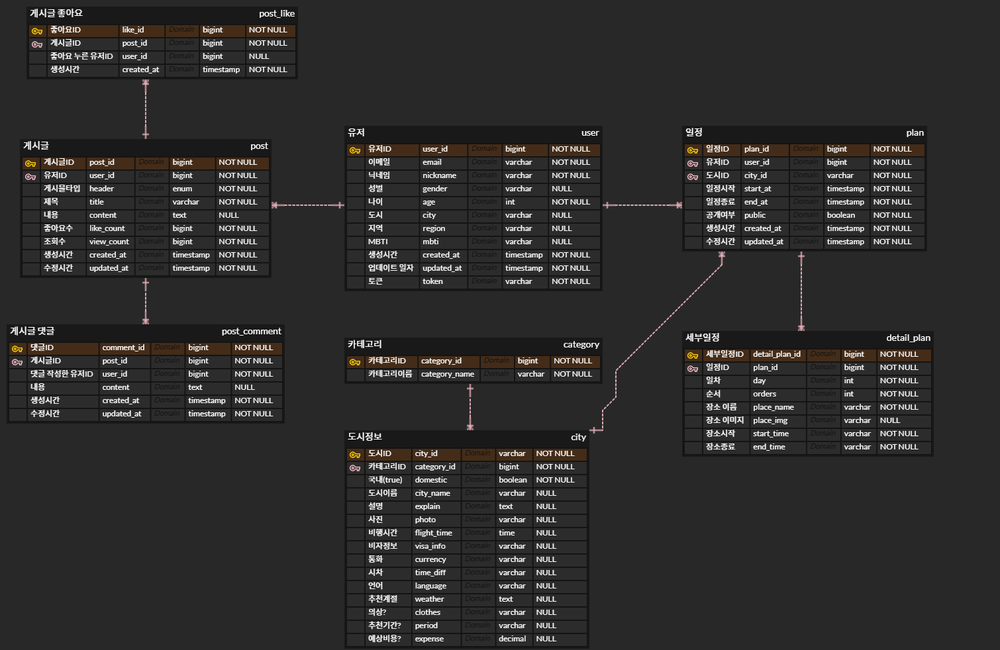

</img>

---

# 📆 프로젝트 진행 기간

- 개발 기간: 2024.11.22~2024.12.19
- Oreumi 백엔드 6기 3차 프로젝트

---

# 🎈 프로젝트 소개

- [**Notion 바로가기**](https://www.notion.so/oreumi/32196299e33742ddbea42f9521476561?pvs=25)


💡 **어디로?**는 사용자가 원하는 여행 목적에 맞춰  
다양한 **여행지**, **숙소**, **맛집 정보**를  
검색하고 탐색할 수 있는 **여행 포털 플랫폼**입니다.

---

# 🎯 주요 기능


---

# ✨ 서비스 링크
## http://example.com

---

# 💻 화면 구성


---

# 🛠 서비스 환경 (Service Environment)

## 🖥️ Backend
- **언어:** Java 17
- **프레임워크:** Spring Boot 3.4.0
- **데이터베이스:** MySQL 8.0.39
- **ORM:** JPA
- **빌드 도구:** Gradle 

## 🌐 Frontend
- **프레임워크:** React 18.3.1

## ⚙️ Development Tools
- **IDE:** IntelliJ IDEA
- **협업 도구:** Notion, GitHub, ERD Cloud, Figma

## 🚀 Deployment
- **환경:** AWS EC2, AWS RDS


## 기술 스택 (Tech Stack)

### Backend
  
  
  
  


### Frontend


### Development Tools
  
  
  
  


### Deployment
  


---

# 📃 API 명세

### 🙋🏻‍♂️ 회원 API

| 기능 | method | url | 설명 |
| --- | --- | --- | --- |
| 회원가입 | POST | /api/join |  |
| 로그인 | POST | /api/login |  |
| 로그아웃 | GET | /api/logout |  |
| 닉네임 중복확인 | GET | /api/check/nickname |  |
| 회원탈퇴 | PUT? DELETE? | /api/withdrawal |  |

### 🏪 커뮤니티 API`1

| 기능 | method | url | 설명 |
| --- | --- | --- | --- |
| 게시글 작성 | POST | /api/posts |  |
| 게시글 수정 | PUT | /api/posts/{postId} |  |
| 게시글 삭제 | DELETE | /api/posts/{postId} | 게시글 단건 삭제 |
| 게시글 전체 조회 | GET | /api/posts |  |
| 게시글 단건 조회 | GET | /api/posts/{postId} | 호출시 조회수 증가 필요 |
| 게시글 좋아요 등록 | POST | /api/posts/{postId}/like |  |
| 게시글 좋아요 취소 | DELETE | /api/posts/{postId}/like |  |
| 좋아요 순 게시물 조회 | GET | /api/posts/by-likes |  |
| 조회수 순 게시물 조회 | GET | /api/posts/by-views |  |
| 헤더별 게시물 조회 | GET | /api/posts/by-header |  |
| 좋아요 상태 조회 | GET | /api/posts/{postId}/like/status |  |

### 🪕 댓글 API

| 기능 | method | url | 설명 |
| --- | --- | --- | --- |
| 게시글 댓글 작성 | POST | /api/comments |  |
| 게시글 댓글 수정 | PUT | /api/comments/{commentId} | 작성자만 가능 |
| 게시글 댓글 삭제 | DELETE | /api/comments/{commentId} | 작성자만 가능 |
| 게시글 댓글 조회 | GET | /api/post/{postId}/comments |  |
| 게시글 댓글 개별 조회 | GET | /api/comments/{commentId} |  |

### **👨🏻‍🎓 앨런 API**

| 기능 | method | url | 설명 |
| --- | --- | --- | --- |
| 앨런에게 질문 | GET | /alan?content= |  |

### 📒 마이페이지 API

| 기능 | method | url | 설명 |
| --- | --- | --- | --- |
| 내 일정 조회 | GET | /my-plans |  |
| 내 일정 수정 | PUT | /my-plans/{planId} |  |
| 내 일정 공개/비공개 | POST | /my-plans/{planId}/toggle-visibility | 공개→비공개 : 게시판의 글도 삭제  |
| 내 일정 삭제 | DELETE | /my-plans/{planId} |  |
| 회원정보 수정 | PUT | /users/{userId} |  |

### ✈ 여행 검색 API

| 기능 | method | url | 설명 |
| --- | --- | --- | --- |
| AI 여행 일정 검색 | POST | /api/searchTrip |  |
| 여행 일정 저장 | POST | /api/savePlan |  |

---

# 프로젝트 구조

```ㅇ```
---

# 🎨 화면 설계서
- [Figma 링크](https://www.figma.com/design/rYW4C588GWq76y1KePj0hA/%EC%96%B4%EB%94%94%EB%A1%9C%3F?node-id=3-2&p=f&t=SAxJPpAUcTieTO5M-0)

---

# ⚙️ ERD 설계도
</img>

---

# 🎬 시연 영상


---

# 👨‍💻 조원 소개 👩‍💻

| 이름       | GitHub 프로필                          |
| ---------- | ------------------------------------- |
| **안형민** | [anhyeongmin](https://github.com/anhyeongmin) |
| **안서현** | [seohyun96](https://github.com/seohyun96)     |
| **문규찬** | [gyuchanm](https://github.com/gyuchanm)       |
| **정의진** | [ejjeong9103](https://github.com/ejjeong9103) |
| **이진헌** | [sodami-hub](https://github.com/sodami-hub)   |

