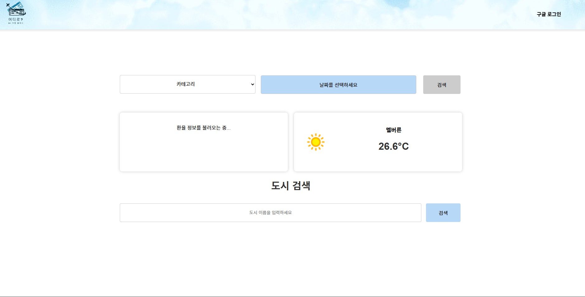
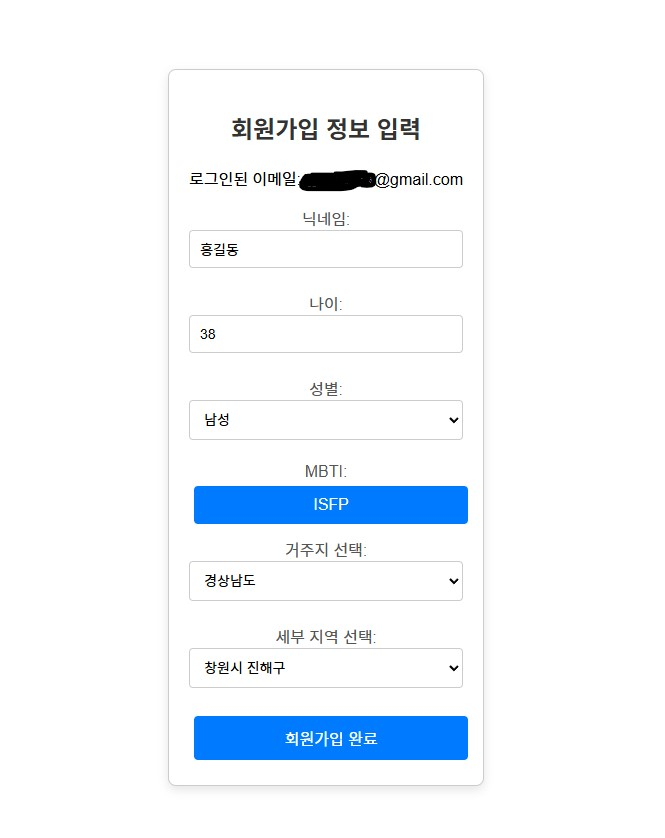
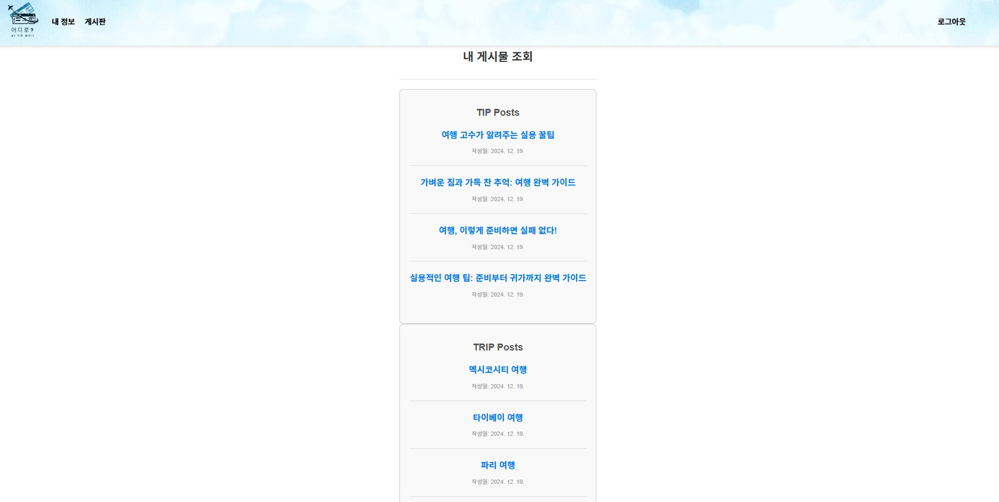
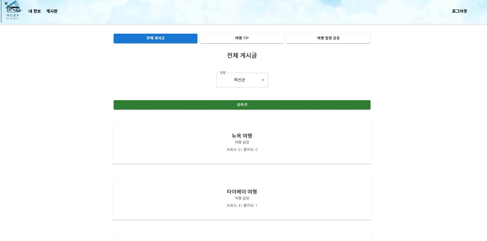
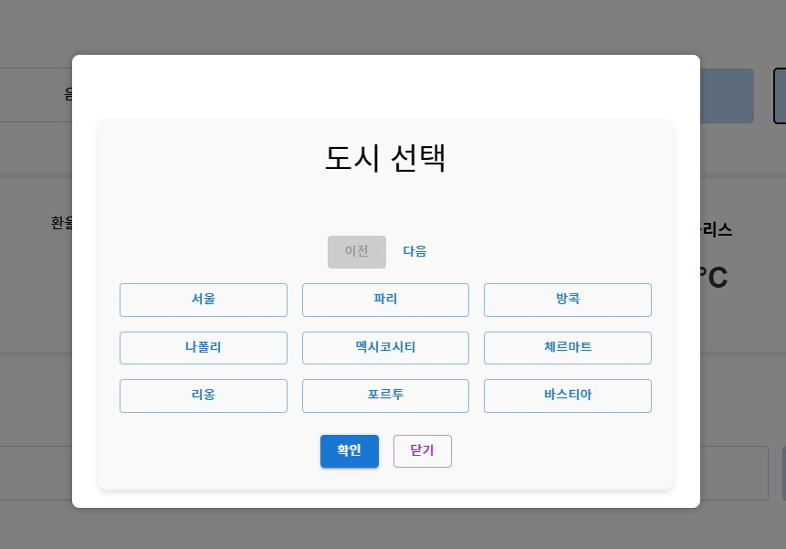
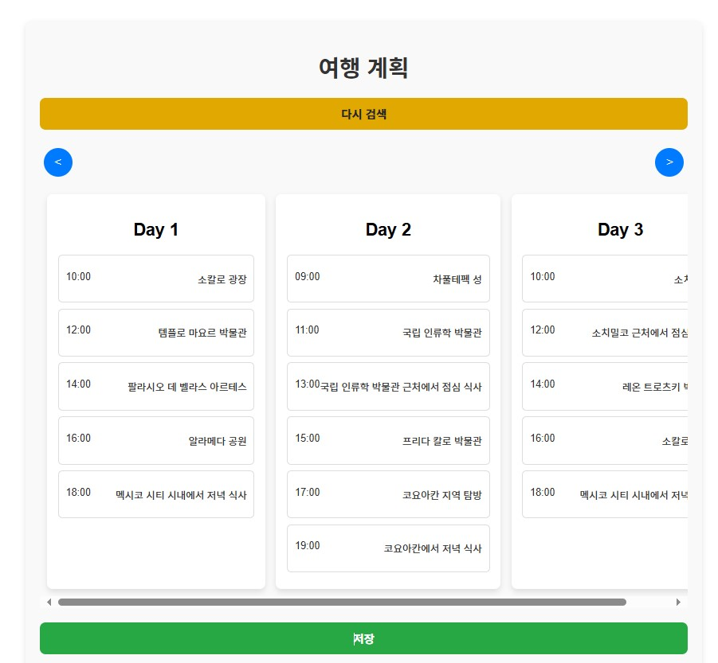
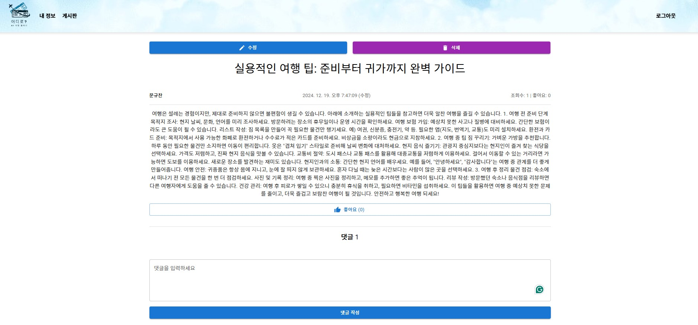
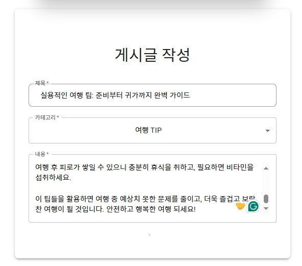
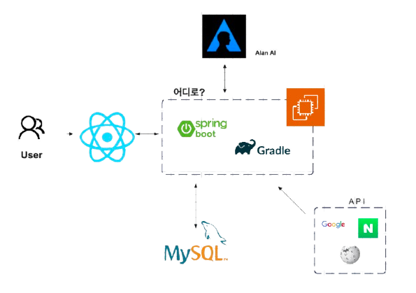
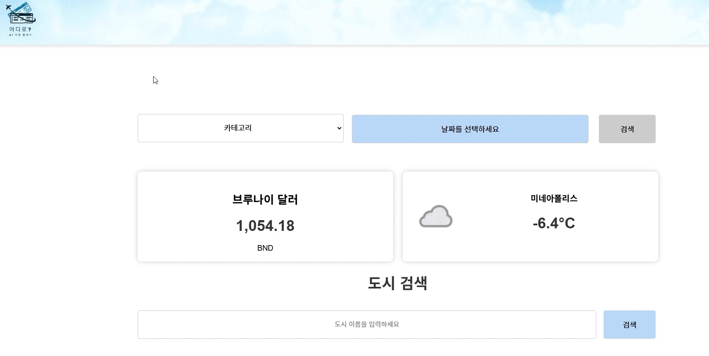

</img>

---

# 📆 프로젝트 진행 기간

- 개발 기간: 2024.11.22~2024.12.19
- Oreumi 백엔드 6기 3차 프로젝트

---

# 🎈 프로젝트 소개

- [**Notion 바로가기**](https://www.notion.so/oreumi/32196299e33742ddbea42f9521476561?pvs=25)


💡 **어디로?**는 사용자가 취향과 관심사에 맞추어 </br>
다양한 **여행지**를 검색하고 여행 일정을 구성하고 </br>
여러 도시 정보를 검색할 수 있는 **여행 포털 플랫폼**입니다.

---

# ✨ 서비스 링크
## http://example.com

---

# 💻 화면 구성
|                                         |                                        |
|-----------------------------------------|----------------------------------------|
| **메인 페이지**                              | **회원가입**                               | 
|       |        |
| **마이페이지**                               | **게시판**                                |
|         |         |
| **검색창(도시선택)**                           | **로딩창**                                |
|  |       |
| **일정결과**                                | **도시검색결과**                             |
|       |  |
| **게시글**                                 | **게시글 작성**                             | 
|           |     |

---

# 🛠 기술 스택 (Tech Stack)

### 🖥️ Backend
  
  
  
  


### 🌐 Frontend


### ⚙️ Development Tools
  
  
  
  


### 🚀 Deployment
  


---

# 🎫 기능요구서

### ✏️ 회원 기능 명세

| **기능명** | **주 기능** | **설명** |
| --- | --- | --- |
| **회원가입** | SNS 간편 가입 | 소셜 미디어 계정 (구글)을 통한 회원가입 |
| **로그인** | SNS 간편 로그인 | 소셜 미디어 계정 (구글)을 통한 로그인 |

### 🙋🏻‍♂️ 마이페이지 기능 명세

| **기능명** | **주 기능** | **설명**                                                                                                                             |
| --- | --- |------------------------------------------------------------------------------------------------------------------------------------|
| **내 일정 조회 및 수정** | 사용자가 저장한 일정을 조회 및 수정 | 사용자는 저장된 일정을 확인하고, 세부 내용을 수정하거나 변경 가능 </br> 저장한 일정은 공개/비공개 설정을 통해 게시판의 일정 공유 페이지에 일정을 공개할 수 있음 </br> 비공개로 설정된 일정은 다른 사용자에게 표시되지 않음 |
| **회원 정보 수정** |  | 사용자가 회원 가입 시 저장된 정보 수정 가능                                                                                                          |

### ✈ 여행 일정 추천 기능 명세

| **기능명** | 주기능 | **설명**                                                                                  |
| --- | --- |-----------------------------------------------------------------------------------------|
| **AI 여행 일정 추천 시스템** | 앨런 ai를 이용해서 여행 일정 계획 | 사용자가 입력한 여행 카테고리와 여행 날짜를 바탕으로 개인 맞춤형 여행 일정을 추천 <br/> 추천된 일정은 사용자 맞춤형으로 제공되며 수정 및 저장이 가능 |

### 📚 도시 검색 기능 명세

| **기능명** | **주 기능** | **설명** |
| --- | --- | --- |
| **도시 검색** | 도시명 검색 시 도시 관련 정보 제공 | 사용자가 도시명 검색 시 도시 정보, 도시 여행 후기 블로그, 유튜브 영상 정보를 제공  |

### ⛱️ 환율 및 날씨 기능 명세

| **기능명** | **주 기능** | **설명** |
| --- | --- | --- |
| **날씨 정보 제공** |  | 각 나라의 도시별 날씨 정보 제공 |
| **환율 정보 제공** |  | 각 나라의 환율 정보 제공 |

### **🏪 커뮤니티 기능 명세**

| **기능명** | **주 기능** | **설명** |
| --- | --- | --- |
| **게시글 작성** |  | 회원만 게시글 작성이 가능 |
| **게시글 수정 및 삭제** |  | 게시글 작성자만 게시글 수정 및 삭제 가능 |
| **게시글 좋아요 등록 및 취소**  |  | 게시글 별 하나의 계정에 한 번만 등록 가능
좋아요 등록/취소 시 실시간으로 좋아요 수 업데이트  |
| **좋아요 순 게시물 조회** |  | 좋아요 수를 기준으로 게시글을 내림차순으로 조회하여 사용자가 가장 인기 있는 게시글을 확인  |
| **조회수 순 게시물 조회** |  | 좋아요 수를 기준으로 게시글을 내림차순으로 조회하여 사용자가 가장 많이 조회된 게시글을 확인 |

### 🪕 댓글 기능 명세

| **기능명** | **주 기능** | **설명** |
| --- | --- | --- |
| **게시글 댓글 작성** |  | 회원만 게시글 댓글 작성 가능 |
| **게시글 댓글 수정 및 삭제** |  | 댓글 작성자만 수정 및 삭제 가능 |

---

# 📃 API 명세

### 🙋🏻‍♂️ 회원 API

| 기능 | method | url | 설명 |
| --- | --- | --- | --- |
| 회원가입 | POST | /api/join |  |
| 로그인 | POST | /api/login |  |
| 로그아웃 | GET | /api/logout |  |
| 닉네임 중복확인 | GET | /api/check/nickname |  |
| 회원탈퇴 | PUT? DELETE? | /api/withdrawal |  |

### 🏪 커뮤니티 API

| 기능 | method | url | 설명 |
| --- | --- | --- | --- |
| 게시글 작성 | POST | /api/posts |  |
| 게시글 수정 | PUT | /api/posts/{postId} |  |
| 게시글 삭제 | DELETE | /api/posts/{postId} | 게시글 단건 삭제 |
| 게시글 전체 조회 | GET | /api/posts |  |
| 게시글 단건 조회 | GET | /api/posts/{postId} |  |
| 게시글 좋아요 등록 | POST | /api/posts/{postId}/like |  |
| 게시글 좋아요 취소 | DELETE | /api/posts/{postId}/like |  |
| 좋아요 순 게시물 조회 | GET | /api/posts/by-likes |  |
| 조회수 순 게시물 조회 | GET | /api/posts/by-views |  |
| 헤더별 게시물 조회 | GET | /api/posts/by-header |  |
| 좋아요 상태 조회 | GET | /api/posts/{postId}/like/status |  |

### 🪕 댓글 API

| 기능 | method | url | 설명 |
| --- | --- | --- | --- |
| 게시글 댓글 작성 | POST | /api/comments |  |
| 게시글 댓글 수정 | PUT | /api/comments/{commentId} | 작성자만 가능 |
| 게시글 댓글 삭제 | DELETE | /api/comments/{commentId} | 작성자만 가능 |
| 게시글 댓글 조회 | GET | /api/post/{postId}/comments |  |
| 게시글 댓글 개별 조회 | GET | /api/comments/{commentId} |  |

### **👨🏻‍🎓 앨런 API**

| 기능 | method | url | 설명 |
| --- | --- | --- | --- |
| 앨런에게 질문 | GET | /alan?content= |  |

### 📒 마이페이지 API

| 기능 | method | url | 설명 |
| --- | --- | --- | --- |
| 내 일정 조회 | GET | /my-plans |  |
| 내 일정 수정 | PUT | /my-plans/{planId} |  |
| 내 일정 공개/비공개 | POST | /my-plans/{planId}/toggle-visibility | 공개→비공개 : 게시판의 글도 삭제  |
| 내 일정 삭제 | DELETE | /my-plans/{planId} |  |
| 회원정보 수정 | PUT | /users/{userId} |  |

### ✈ 여행 검색 API

| 기능 | method | url | 설명 |
| --- | --- | --- | --- |
| AI 여행 일정 검색 | POST | /api/searchTrip |  |
| 여행 일정 저장 | POST | /api/savePlan |  |

### 🔎 외부 API

| 기능 | method | url | 설명 |
| --- | --- | --- | --- |
| 날씨 조회 | GET | /api/weather |  |
| 환율 조회 | GET | /api/exchange-rates |  |
| 도시 검색 | GET | /api/wikipedia/search |  |
| 블로그 검색 | GET | /search |  |

---

# 🏛 프로젝트 구조

```
📦backend
 ┣ 📂src
 ┃ ┣ 📂main
 ┃ ┃ ┣ 📂java
 ┃ ┃ ┃ ┗ 📂com
 ┃ ┃ ┃ ┃ ┗ 📂howmuch
 ┃ ┃ ┃ ┃ ┃ ┗ 📂backend
 ┃ ┃ ┃ ┃ ┃ ┃ ┣ 📂config
 ┃ ┃ ┃ ┃ ┃ ┃ ┣ 📂controller
 ┃ ┃ ┃ ┃ ┃ ┃ ┣ 📂entity
 ┃ ┃ ┃ ┃ ┃ ┃ ┃ ┣ 📂city_info
 ┃ ┃ ┃ ┃ ┃ ┃ ┃ ┣ 📂community
 ┃ ┃ ┃ ┃ ┃ ┃ ┃ ┣ 📂dto
 ┃ ┃ ┃ ┃ ┃ ┃ ┃ ┣ 📂plan
 ┃ ┃ ┃ ┃ ┃ ┃ ┃ ┗ 📂user
 ┃ ┃ ┃ ┃ ┃ ┃ ┣ 📂repository
 ┃ ┃ ┃ ┃ ┃ ┃ ┣ 📂service
 ┃ ┃ ┃ ┃ ┃ ┃ ┣ 📂util
 ┃ ┃ ┃ ┃ ┃ ┃ ┣ 📂youtube
 ┃ ┃ ┗ 📂resources
 ┃ ┃ ┃ ┣ 📂static
 ┃ ┃ ┃ ┣ 📂templates
 ┃ ┃ ┃ ┃ ┣ 📂mytrip
 ┃ ┗ 📂test
 📦frontend
 ┗ 📂src
```

---

# 🎨 화면 설계서
- [Figma 링크 바로가기](https://www.figma.com/design/rYW4C588GWq76y1KePj0hA/%EC%96%B4%EB%94%94%EB%A1%9C%3F?node-id=3-2&p=f&t=SAxJPpAUcTieTO5M-0)

---

# ⚙️ ERD 설계도
</img>

---

# 🔍 시스템 구조도
</img>

---

# 🎬 시연 영상

[](https://youtu.be/Qo-a6fptvMM)

---

# 👨‍💻 조원 소개 👩‍💻

| 이름       | GitHub 프로필                          |
| ---------- | ------------------------------------- |
| **안형민** | [anhyeongmin](https://github.com/anhyeongmin) |
| **안서현** | [seohyun96](https://github.com/seohyun96)     |
| **문규찬** | [gyuchanm](https://github.com/gyuchanm)       |
| **정의진** | [ejjeong9103](https://github.com/ejjeong9103) |
| **이진헌** | [sodami-hub](https://github.com/sodami-hub)   |

